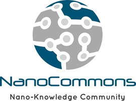
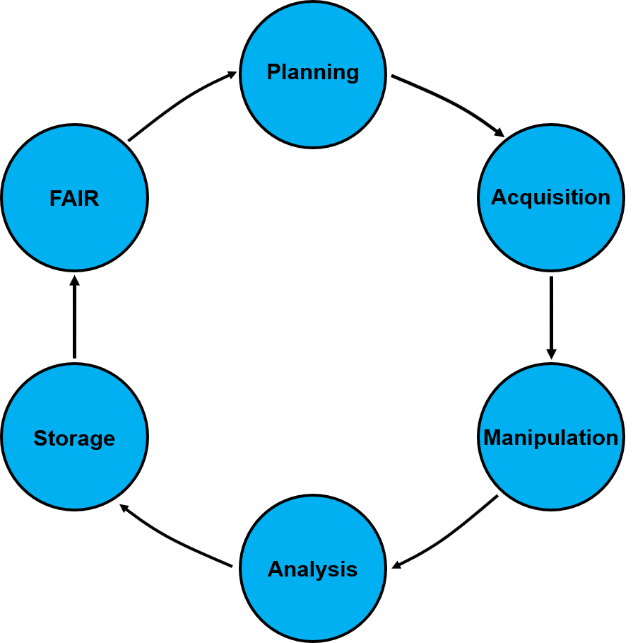
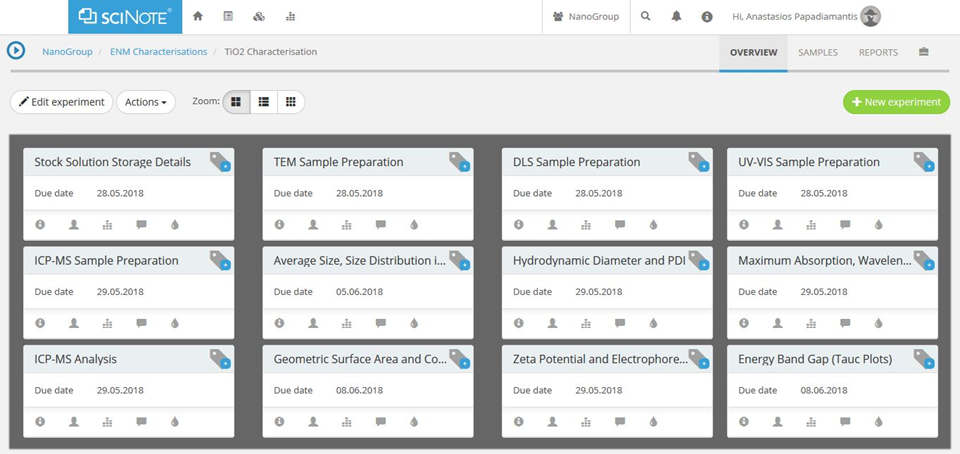
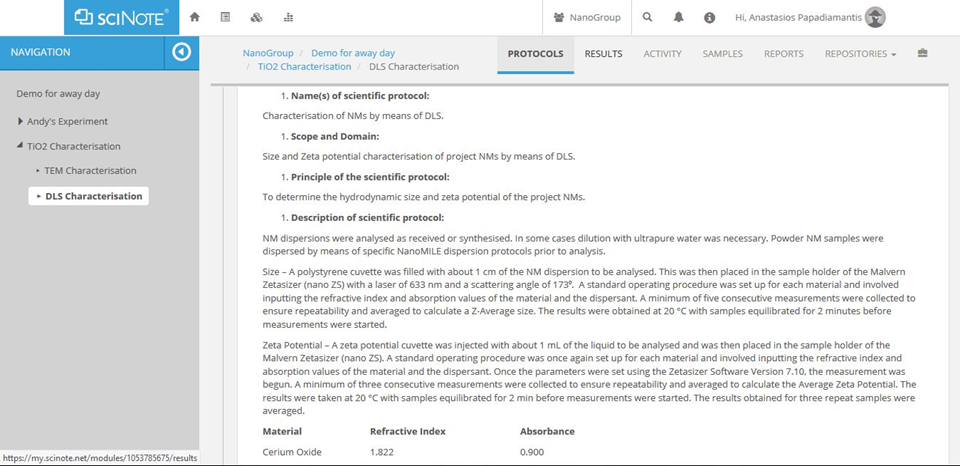
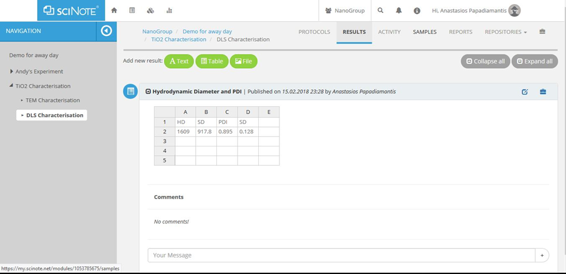
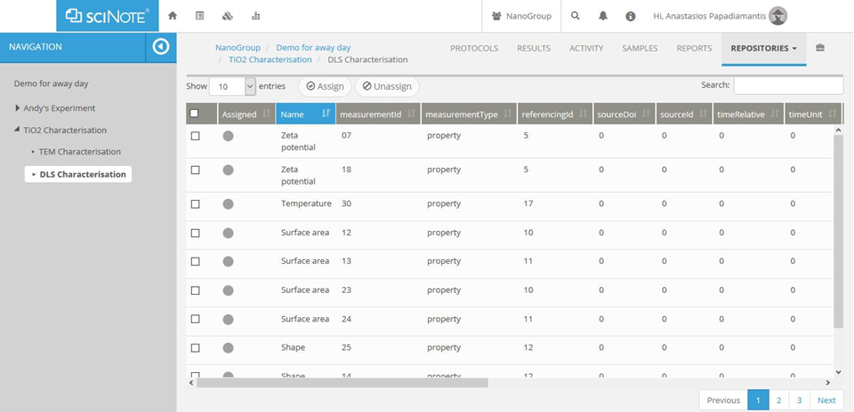

# NanoCommons Data Management Plan

## Table of contents  
[Summary](#summary)  
[Introduction](#introduction)    
[Data set description](#data_set_description)  
[Data sharing](#data_sharing)  
[Archiving and preservation](#archiving_and_preservation)	   
[1. Data summary](#data_summary)	  
[1.1 Purpose of the data collection/generation](#purpose_of_data_collection)	  
[1.2 Relation to the objectives of the project](#relation_to_the_objectives)  
[1.3 Types and formats of data](#types_and_formats)  
[1.3.1 Types of Data](#types_of_data)  
[1.3.2 Formats of Data](#formats_of_data)  
[1.4 Reuse of data](#reuse_of_data)  
[1.5 Origin of the data](#origin_of_the_data)  
[1.6 Expected size of the data](#expected_size_of_the_data)  
[1.7 Utility of data and models](#utility_of_data_and_models)     
[2. FAIR data](#fair_data)  
[2.1 Making data findable, including provisions for metadata](#making_data_findable)      
[2.1.1 Making data discoverable, including provisions for metadata](#making_data_discoverable)    
[2.1.2 Identifiers and naming conventions](#identifiers)    
[2.2 Making data openly accessible](#making_data_openly_accessible)    
[2.2.1 Open Data](#open_data)    
[2.2.2 Free Access](#free_access)    
[2.3 Making data interoperable](#making_data_interoperable)  
[2.3.1 Supported data exchange formats](#supported_data_exchange)  
[2.4 Increase data reuse (through clarifying licenses)](#increase_data_reuse)  
[3. Allocation of resources](#allocation_of_resources)  
[4. Data security](#data_security)  
[5. Ethical aspects](#ethical_aspects)  
[Final remarks](#final_remarks)  
[References](#references)  
[Appendixes](#appendixes)  

## Summary 

This deliverable presents the initial data management plan (DMP) for the
starting community research infrastructure NanoCommons (grant no 731032). It is a living
document that will be updated over the course of the project, with the
final plan to be delivered at the end of the project. We anticipate that
at least two other versions of the plan will be developed, to accommodate
the fast changing field of Open and FAIR (Findable, Accessible,
Interoperable and Reusable) data in Europe. The initial DMP covers a
significant part of the life cycle of research data, but cannot cover its
life after the end of this project. It covers the initial process of
thinking about how research data will be captured and handled during the
research, networking and transnational activities (JRA, NA and TA,
respectively), the follow up process of making it Open and FAIR, and
finally the long-term deposition of the data (and models and other outputs),
to ensure a life after the end of the NanoCommons project.  Note that there
are dedicated activities developing a sustainability plan for the complete
set of NanoCommons tools/services and approaches (i.e. the research
infrastructure itself, including the NanoCommons Data Warehouse (data
repository), which will ensure long term access under the FAIR principles
and will be made available to current and future nanosafety projects and
other stakeholders. The NanoCommons Data Warehouse may also be used as an
application for an Advanced Community, and application for establishment
of an European Research Infrastructure Consortium (ERIC), via Deliverable
report D10.3 “NanoCommons Sustainability Plan”. The NanoCommons data
management strategy follows the description-of-action (DoA), (Section
29.3, page 49) which prescribes access to all research data produced in
the project, including that produced with Users of the TA facilities.
Therefore, this deliverable will also describe suggestions for how the
project partners and TA users  can make data available in both Open and
FAIR formats.  Note that the NanoCommons DMP builds on DMP’s from related
projects such as OpenRIskNet and adapts it for other types of data, such
as that generated by Transnational Access (TA) Users. 

## Abbreviations

**List of abbreviations**  
APIs - Application Programming Interface  
CEN - European Standardisation Organisation  
ChEBI - Chemical Entities of Biological Interest  
CLW - Copyright, License, Waiver  
DoA - Description of Action  
DMP - Data Management Plan  
EC - European Commission  
ECHA - European Chemicals Agency   
EFSA - European Food Safety Authority  
EFO - The Experimental Factor Ontology  
ENM - Engineered Nanomaterial   
EMA - European  Medicines Agency  
EOSC- EU Open Science Cloud  
ERIC - European Research Infrastructure Consortium   
EUON - European Union Observatory for Nanomaterials  
FAIR - Findable, Accessible, Interoperable, Reusable  
GDPR - General Data Protection Regulation  
HGNC - Human Genome Nomenclature Committee  
IPR - Intellectual Property Rights  
ISO - International Standards Organisation  
JRA - Joint Research Activities  
JRC - Joint Research Center  
MoU - Memorandum of Understanding  
MPATH - Mouse Pathology Ontology  
NA - Networking Activities  
NCBI - National Center for Biotechnology Information  
NCIT - National Cancer Institute Thesaurus  
NEMs - New and Emerging Materials  
NM - Nanomaterial  
OAE - Ontology of Adverse Events  
OBI - Ontology for Biomedical Investigations  
OECD - Organisation for Economic Cooperation and Development  
ORD - Open Research Data Pilot   
PATO - Phenotype And Trait Ontology  
QA - Quality Assurance   
QC - Quality Control  
QSAR - Quantitative Structure-Activity Relationships  
R&D - Research and Development  
RDM - Research Data Management  
RDMO - Research Data Management Online (Plan)  
RDS - Research Datastore  
SME - Small to Medium Enterprise  
SOP - Standard Operating Procedure  
TA - Transnational Access  
UO - Units of Measurement Ontology  
WWTP - Working Party on Manufactured Nanomaterials  
  

## Introduction 

The European Commission (EC) is running a flexible pilot under Horizon 2020
called the Open Research Data Pilot (ORD Pilot). The ORD pilot aims to improve
and maximise access to, and reuse of, research data generated by Horizon 2020
projects and ask projects to think about the totality of their data in all
forms, taking into account the need to provide open scientific information,
undertake commercialisation activities and Intellectual Property Rights (IPR)
management, address data privacy concerns and ensure data security, as well
as data management and preservation questions [[1](#user-content-ref1)]. Open data is data for which
everyone has the rights to access, reuse, repurpose, and redistribute. The ORD
Pilot aims to make the research data generated by selected Horizon 2020 projects
accessible with as few restrictions as possible, while at the same time
protecting sensitive data from inappropriate access [[2](#user-content-ref2)]. Projects starting from
January 2017 are by default part of the ORD Pilot, including the Research
infrastructures and e-Infrastructures, and as such are required to develop a
Data Management Plan (DMP).

To help optimise the potential for future sharing and reuse of data, the
NanoCommons DMP helps the project partners and Transnational Access (TA) Users
to consider any problems or challenges that may be encountered in making their
data Open and FAIR and helps them to identify ways to overcome these. This DMP
is a “living” document outlining how the research data collected or generated
will be handled during and after the NanoCommons project. It follows the
Guidelines on FAIR Data Management in Horizon 2020 [[3](#user-content-ref3)] and is based around the
realistic resources available to the project partners and TA Users taking the
current knowledge into account.  The ongoing activities to keep the DMP up to
date will follow an online, distributed approach as outlined in the Guidelines
for creating an online DMP [[4](#user-content-ref4)]. As part of our community building and sharing
of best practices approach, the NanoCommons initial DMP will be made publically
available to other nanosafety and nanoinformatics projects to reuse, and all
updates will be announced widely to the relevant communities (including
OpenRiskNet). 

### Data set description 

This section refers to what kinds of data NanoCommons will collect and/or generate, and to whom these data might be useful later. The data set refers to: 
-	The data and metadata needed to validate results in scientific publications;  
-	The data and metadata needed to develop and validate the predictive in silico models for nanosafety, via the Joint Research Activities (JRA);  
-	Data and metadata generated by Users through TA activities; and,  
-	Other curated and/or raw data and metadata that may be required for validation purposes or with reuse value.  

Further, these questions are addressed in order to determine the potential reuse value of the data:  
-	What is the data about?  
-	Who created it and why?  
-	In which forms it is available?  
-	What (if any) standards were applied in generating the data?  

The metadata provided with the datasets answers such questions to enable data to be found and understood, ideally according to the particular standards applied. Finally the metadata, documentation and standards will help in making the data FAIR (Findable, Accessible, Interoperable, and Reusable) [REF,REF,REF].  

### Data sharing 

According to the ORD Pilot programme, by default as much of the resulting data
as possible should be archived as Open Access. Therefore legitimate reasons for
not sharing resulting data should be explained in the DMP. However, data
protection or IPR agreements should not be compromised in any way, and data
sharing should be done responsibly. Therefore, the DMP describes any ethical or
legal issues that can have an impact on data sharing.

### Archiving and preservation 

To ensure that publicly funded research outputs can have a positive impact on
future research, for policy development, and for societal change it is important
to assure the availability of data for a long period beyond the lifetime of the
project. However, this does not refer only to storage in a research data repository,
but also the need to consider the (re-)usability of the data. One of the main goals
of the research infrastructure being created by the NanoCommons project is to
harmonise nanosafety data and make it interoperable and sustainable, as a means
to facilitate in silico nanosafety assessment thereby reducing the need for 
costly and ethically questionable in vivo studies while supporting the route to 
market of nano-enabled products. Therefore, the project has a special obligation
to preserve both the software tools and any code produced to perform specific in
silico analyses and the data underpinning these models and tools. This will also 
require a high degree of clarity about any proprietary or open source tools that
will be needed to validate and use the preserved data. The general ethos of 
NanoCommons is that all datasets imported into the NanoCommons Knowledge Base 
using funds provided by NanoCommons will be made both Open and FAIR. The agreement 
with TA Users, previous projects who will provide datasets, and any other data 
sources utilised in the delivery of the NanoCommons research infrastructure will 
include specifications on the Open and FAIR provisions, as per Appendix A.

The structure of the NanoCommons DMP follows the Horizon 2020 ORD Pilot 
instructions on how to create a DMP. Therefore, additional to this document, 
the plan is stored and updated online using the recommended DMP tool 
(Figure 1) available at dmponline.dcc.ac.uk/ (see also Appendix B).

**The NanoCommons Research Data Management Plan**  
The Data Management Plan (DMP) is essential to ensure the capture of 
return-on-investment (RoI) for the resources put in by the European Union,
via the EC’s H2020 research framework. An RDM strategy does not describe 
the data, but it describes the processes of the management of the data 
throughout its entire lifecycle.  The NanoCommons ethos is that Data 
should be both FAIR and Open, and all our activities will expressly 
utilising formats that support this. NanoCommons will build on the lessons 
and experience from the NanoREG project, which utilised a General Assembly 
meeting to decide on an open licence for specific outputs if the 
Consortium Agreement did not specify the reuse conditions explicitly. 

Before we continue, we should define to what kind of data this DMP 
applies. Section 1.3 provides more detail of the types of data to be 
imported into or generated within NanoCommons, but the starting point
is basically any data produced in the NanoCommons project, which
includes, but is not limited to, experimentally measured data and
computed data via modelling or statistics, including that produced 
by TA Users as part of their access provision.

#### Expectations

The NanoCommons DoA describes the goal of this deliverable (due at Month 6):
*A specific strategy to provide open access to data will be developed according to the recommendations of the Horizon2020 ORD Pilot. The strategy will include the development of initial and final FAIR DMPs (M6 and M48 respectively), which will outline and support implementation of procedures to ensure full access to data incorporated within NanoCommons.*

However, a second section of our DoA is essential, and is part of our agreement (contract) with the EC, which describes in more detail how NanoCommons is expected to provide access to third-parties of data produced within NanoCommons (emphasize ours):

   *29.3 Open access to research data
   Regarding the digital research data generated in the action (‘data’), the beneficiaries must:    
      a.	deposit [it] in[to] a research data repository and take measures to make it possible for third parties to access, mine, exploit, reproduce and disseminate — free of charge for any user — the following:  
          i.	the data, including associated metadata, needed to validate the results presented in scientific publications as soon as possible;  
          ii.	other data, including associated metadata, as specified and within the deadlines laid down in the 'data management plan';  
      b.	provide information — via the repository — about tools and instruments at the disposal of the beneficiaries and necessary for validating the results (and — where possible — provide the tools and instruments themselves).*
  
   *This does not change the obligation to protect results in Article 27, the confidentiality obligations in Article 36, the security obligations in Article 37 or the obligations to protect personal data in Article 39, all of which still apply. As an exception, the beneficiaries do not have to ensure open access to specific parts of their research data if the achievement of the action's main objective, as described in Annex 1, would be jeopardised by making those specific parts of the research data openly accessible. In this case, the DMP must contain the reasons for not giving access.*

These formal expectation set aside, the project has quite some liberty in setting our own expectations, and these may even be different from one partner to another.  All partners have their legal obligations and the NanoCommons project is a collaboration into which we all invest and from which all partners will harvest knowledge and data. As such, enabling each other is our best bet to result in a successful innovation project that has maximum impact for partners and for the wider nanosafety research and nanoinformatics communities. Clear mutual expectations are an essential component of that.

## 1. Data summary   

<table>
  <tr>
    <th>Summary of the data addressing the following issues</th>
  </tr>
</table>  

### 1.1 Purpose of the data collection/generation 

The data collected/generated within the NanoCommons Project aims to
provide a harmonised and streamlined workflow covering all aspects 
of the data lifecycle, which includes experimental planning, data 
acquisition, manipulation and analysis, data storage and Open and 
FAIR access when possible (for further information please refer to 
Appendix B). The collected/generated data will be used to meet the 
project’s objectives in developing and openly providing the in silico 
nanosafety modelling and nanoinformatics tools needed by the 
nanosafety scientific community for the production of high quality,
harmonised and sustainable data. To achieve these objectives the 
NanoCommons project aims to implement appropriate standardised 
experimental procedures and data curation techniques, to promote 
ontology harmonisation and produce datasets aligned with the highest
standards of scientific quality within the project.

Thus, the data collected/generated within NanoCommons will be available 
in the correct format and readily available to be implemented and used 
for analysis via the tools developed within the project. At the same 
time, data harmonisation will allow data interoperability and the 
combination of different datasets (from a range of sources, as long as 
the conditions for data sharing are compatible with the needs of NanoCommons
- see Appendix A for details), where applicable and following agreement of 
the respective owners, that will allow more complex analyses to be performed 
and can also promote cross-project/field cooperation and translational 
research. 

### 1.2 Relation to the objectives of the project   
NanoCommons is driven by the European nanosafety, nanomedicine and emerging materials research and regulatory communities need for an e-infrastructure providing a standardised, reproducible and interoperable way to access all available data, knowledge and analysis and facilitate the application of nanoinformatics and modelling tools that have been adapted and verified as suitable for application to nanomaterials.
More than 10 years of nanosafety research has delivered tangible insights into the key science and policy required for the development of safe nano-enabled products. However, this knowledge has yet to be systematised, or made “FAIR”, in a manner that allows:    
-	modellers to develop predictive frameworks and assess their domains of applicability,  
-	industry to utilise the data, models and tools for safe-by-design strategies or as supporting evidence for use in regulatory dossiers,   
-	regulators to compare one form to another or make estimations of data requirements for New and Emerging Materials (NEMs) based on shared properties with NMs, or  
-	educators to utilise in teaching toxicology, ecotoxicology, environmental fate and modelling of the behaviour of ENMs.  

To address this gap, NanoCommons will create an openly accessible e-infrastructure serving the current and future (unmet) needs of the key research communities and pivotal industrial users and regulators.

NanoCommons will facilitate:  
1.	the efficient collection, integration, curation and maintenance of existing data and methods along with development and optimisation of the tools and user interfaces to interrogate them (JRA),  
2.	the provision of access to the data, methods and tools collected or produced under the project, along with expert guidance in their use and in experimental design and workflows to harmonise data quality into the future (TA), and  
3.	community building including bridging disciplinary gaps (e.g. toxicology and ecotoxicology, experimental and modelling), promoting best practice in data quality (e.g. Quality Assurance (QA) audits, Independent Experimental Data audits), and development of User case studies demonstrating the capability of the NanoCommons infrastructure to address real stakeholder challenges in partnership with industry & regulators (NA).  

NanoCommons is designed to integrate the Knowledge infrastructure for risk assessment of novel and emerging materials on a European and international scale, and provide (remote) access to data, data mining, modelling and risk assessment tools to all European researchers, from academia and industry, as well as regulators, ensuring their optimal use and joint development.

### 1.3 Types and formats of data 

#### 1.3.1 Types of Data  
An important distinction should be made here between various forms of data to be generated and utilized within NanoCommons:  
1.	Raw or experimental data  
2.	Derived (processed or computed) data  
3.	Data associated with formal publications (literature curated data) (This is typically summarised data, from which the original data cannot really be reconstructed).  
4.	Interactive data, whereby the data is put in the context of other data. For example, integrated with other data sets, etc.  
The first type of data is basically what comes directly from the instruments utilised in the experimental assays or the computational calculations. Ideally this follows the design of a pre-registration, in which the design of the experiment is published before the experiment is performed (see e.g. the Center of Open Science Pre-registration Challenge: cos.io/prereg/). The second type is data derived from the raw data, and aimed at making comparisons between experimental conditions, drawing conclusions, and other kinds of use and reuse of the data. This data may be stored as spreadsheets, but also in many other formats. 

The third and fourth types of data are more about presentation of the data: the third kind is the presentation in formal journal applications and, for example, presented in tables as PDFs, spreadsheets, or data files. The fourth kind is particularly interesting and important to our project: data must be interactively available to enable reuse. For example, our modelling tasks depend on data to be available in a FAIR way (see below).

The Open Science expectations around data basically apply to all four kinds of data. However, it is  clear that different solutions are needed for the different kinds. This is one reason why writing a clear DMP is non-trivial.  The use of electronic notebooks (for both experimental and computational workflows) will ensure that data of types 1 and 2 above will be collected in a harmonised, ontology-linked, and database-compatible manner from the outset, thereby integrating data management with data generation, rather than data management being an add-on activity after associated with, for example, publication requirements for datasets to be deposited in appropriate databases. Free and commercial tools for keeping an electronic notebook are both available.

**Data Life Cycle**  
The Data Life Cycle includes the entire process through which data is generated, acquired, analysed, manipulated and made available through publications and/or data repositories along with the metadata produced during the entire process. The fourth kind of data presented in the previous paragraph can also be seen as an overview of the life cycle of data. However, it should be noted that the availability of data does not constitute the start of the cycle: instead, the design of an experiment is a more appropriate start - see Appendix B for further details of the data life cycle as utilised in NanoCommons.

#### 1.3.2 Formats of Data  

The NanoCommons project aims to mainly use the following 3 data formats, which are broadly accepted by different subgroups of the nanoinformatics community. Each has advantages and disadvantages, which NanoCommons aims to overcome through suitable modifications, that will be documented in full detail within the subsequent deliverables and published metadata. In any case, the nature of the NanoCommons project makes it possible that more data formats will be implemented to facilitate the different needs of the e-infrastructure users, and will be added to subsequent versions of this document as the needs arise.

**1.	ISA (-tab or -json)**  
    a.	The advantage of use of the ISA type templates is the flexibility they demonstrate with respect to creation and design for any type of experiments and the addition / subtraction of columns to fit all experimental needs (methods, descriptors etc.).  
    b.	Disadvantages of the ISA- templates include the lack of description of the file formats for both data and metadata. They are also not necessarily linked with specific ontologies and thus the naming of the columns is not regulated and protocolled. At the same time, only the file names, and not the file types, are generally available. The latter disadvantage could be potentially overcome with the use of an interoperability layer within the data management infrastructure, which will describe the dataset using a specific ontology and taxonomy.  
    c.	The ISA-(TAB/JSON)-nano addon is currently not as developed [REF], but is the started norm in the nano-field, although is rarely applied to the letter. ISA- (TAB/JSON)-nano is being promoted by the US National Cancer Institute and the eNanoMapper data portal.  
  
**2.	NIKC**    
  a.	The advantages of the NIKC template, which is an extension of the ISA-tab nano, are its dynamic nature and design flexibility, being able to facilitate all aspects of nanosafety research (e.g. nanomaterials characterization including transformations and ageing, exposure, environmental as well as human hazard and risk assessment, regulatory), while accepting the attachment of images. The currently developed NIKC/NanoCommons ontology, which builds on the eNanoMapper ontology, also ensures harmonised data curation, the use of specific nomenclature and the ability to combine available datasets, test for experimental and data gaps and increase data quality. The NIKC instance approach is also a big step forward in conceptually representing nanomaterials data as it recognises the dynamic nature of nanomaterials and their interaction with their surroundings. NIKC considers the nanomaterial as single entity with its surrounding environment “demanding” the characterisation of both to be complete. It also offers the possibility to create a data tree that includes experimental workflows, from different aspects of nanosafety research that can link back to the same nanomaterial (when applicable) allowing data interoperability and translational research. Finally, another novelty of the NIKC templates is the use of both protocols and instrument settings / types as data points. This allows both the identification of data mismatches based on slight experimental deviations, as well as potential differences between descriptors being measured using different instruments.   
   b.	The disadvantages of the NIKC templates are that are complicated and time consuming to design and build. They also span at several different tabs that require the logging of a large amount of information. As a result, they need extended training from experienced curators that are also tasked to QC the produced templates. Some of the issues could be circumvented with the development and use of an automated system of template creation, based on a questionnaire system and having a pre-defined set of nanomaterials characterisation template.  Additionally, as more and more study templates are developed, reuse will be possible with potentially minor tweaks.

**3.	ToxML**  
  a.	The advantage of the ToxML data format is the robust design of the files, which also simplifies interoperability. The latter, in certain cases, can also be considered as a disadvantage.  
  b.	The drawbacks for the use of ToxML is the difficulty to implement changes, which have to proposed and then reviewed and accepted by the supervisory board making the process extremely time consuming. As a result, the NanoCommons consortium should make provisions for the implementation of non-standard entries and add the necessary tools to update the entries when the required standard covering them is made available.  

In all cases, the usage of a common ontology for data description and curation can guarantee that the both the data and produced metadata can be understood by both users and machines and can be automatically transferred between services.

### 1.4 Reuse of data 

NanoCommons aims to use the data collected/generated through the project, as well as high quality curated peer-reviewed published data. In terms of tools, the project will identify and use already existing tools (modelling, Quantitative Structure-Activity Relationships (QSARs), Omics etc.) and will work to improve them further using the data collected/generated through the project. The NanoCommons project also aims to harmonise, combine and analyse existing datasets to improve and refine scientific findings and conclusions, promote cross-project/field collaboration and promote translational research. 
For data templates, SOPs and decision trees, we will use, as much as possible, existing data, software tools, open and readily available to all partners. We will aim to produce reusable and extensible tools, and to make use of existing nanomaterials safety and characterisation data, where possible.
SOPs developed within NanoMILE and NanoFASE for characterisation of NMs in biological and environmental matrices are being reused where possible, and any changes documented as part of the metadata and domains of applicability sections of the SOPs.  For example, in the development of SciNote online notebooks, we are utilising existing lab data and lab protocols.

Table 1 below summarises the datasets that are potentially being reused within the context of NanoCommons.

**Table 1**: Existing data generated through other NanoSafety Cluster (NSC) projects and other appropriate projects will be used by the NanoCommons project through collaborative efforts or agreements with the relevant project beneficiaries. This data will in most cases be for use to demonstrate the value to users of data sharing (open and FAIR data) and to facilitate the application of the range of modelling tools being developed. They will also be utilised for analysis of reproducibility of the overall method via comparison of different measurement approaches.

<table>
  <tr>
    <th>Project</th>
    <th>Description of Data</th> 
    <th>Purpose in NanoCommons</th>
  </tr>
  
  <tr>
    <td>NanoMILE</td>
    <td>Characterisation data and calculated descriptors for up to >75 different NMs via the NanoMILE NMs library. Data identifying ENM property factors important for hazard, and representative ENMs that range in those properties.</td>
    <td>To provide baseline characterisation data for a wide panel of NMs, that will be used to parameterise the domain of applicability of the various computational models, as well as for benchmarking of the newly developed models and tools.</td>
  </tr>
      
  <tr>
    <td>NanoFASE</td>
    <td>Fate process relevant data (e.g. separation between sludge and effluent in WWTPs) and characterisation of the transformations of NMs in the different environmental compartments.  Data on microbial degradation of commonly applied coating materials.</td>
    <td>Considerable method development underway, specifically for functional assays to characterise the transformed states of nanomaterials in different environmental compartments. This data will be utilised to demonstrate the validity and utility of the NIKC instances approach, and how the concept expands dramatically the scale of the data available, but also the predictions that can be made utilising the data.</td>
  </tr>
      
  <tr>
    <td>NanoPolyTox, GUIDEnano, SUN</td>
    <td>Release methods and data for NMs enabled product types especially of worked case studies.</td>
    <td>Release data will be utilised to support the NanoCommons risk assessment tools (models) and will provide methods, SOPs and datasets for benchmarking the computational tools.  Any of these projects could also service as Case Study for data  importation into the NanoCommons data warehouse, allowing all required steps to be fully documented and described for subsequent data uploaders. </td>
  </tr>
  
  <tr>
    <td>NIKC</td>
    <td>Characterisation data of nanomaterials through their entire lifecycle in conjunction with characterisation of the surrounding environment. Anticipated use scenarios, matrix, concentration in products, system characteristics (environmental, biological, laboratory, etc.). Exposure and hazard measurements, calculations, and estimates and metadata associated with each of these, including bibliometrics, protocols, equipment, temporal and spatial descriptors, etc.</td>
    <td>The currently curated hazard and exposure data will be utilised to support the NanoCommons hazard and exposure modelling. Over time the expansion of the NIKC towards all aspects of nanosafety research (e.g. fate, risk assessment, regulatory), will broaden data utilisation and interoperability and will also promote translational research. The use of experimental protocols and instruments as data points, will also allow the development of data QC tools to test for data completeness and for protocol optimisation and standardisation. </td>
  </tr>
      
  <tr>
    <td>NANoREG</td>
    <td>Characterisation data for the JRC repository test NMs, and the templates for data collection for selected characterisation end-points.</td>
    <td>The characterisation data are deposited in the eNanoMapper database, and an MoU will be sought to access the characterisation data as part of the Model benchmarking and Domain of applicability  assessment.</td>
  </tr>
  
  <tr>
    <td>eNanoMapper</td>
    <td>Ontology terms, database structure for nanosafety.</td>
    <td>NanoCommons will utilise the existing ontology and extend it with a range of characterisation terms to support the implementation of the decision tree and analytical toolbox.</td>
  </tr>
  
  <tr>
    <td>Projects funded under NMBP-14-2018 (nanoinformatics call)</td>
    <td>The projects funded under this call will be specifically developing nanoinformatics models, and will also require a knowledge warehouse, APIs, and large scale datasets, so we will provide access to NanoCommons developments to facilitate further reuse.</td>
    <td>By facilitating access to and reuse of datasets that it has compiled, curated, integrated and aligned, NanoCommons will be serving the community needs, and more reuse builds a stronger case for subsequent application for funding as an Advanced Research Community. </td>
  </tr>
         
</table>

### 1.5 Origin of the data     

The data sources and offered tools through the project will take into account the original licences for the versions integrated into the NanoCommons infrastructure, if applicable. For data and tools created directly through the project, a respective licensing system will be developed. Similarly, any commercial, open source, or freeware software requiring registration and licensing will be handled in a similar way. Both licensing systems will run as a single entity through an authentication and authorisation service run through DC and/or Biomax [5], taking into account European GDPR law.
It is anticipated that the data and tools produced/developed/integrated into the NanoCommons infrastructure, along with any supporting metadata, documentation and source code where applicable, will include:  
1.	Data, models and tools developed and owned by NanoCommons Partners will be assigned with a Creative Commons licence, allowing their full and free reuse, modification, and redistribution, where applicable, as long as their origin is cited appropriately as far as possible. When only non-commercial reuse is allowed, then a specific, well-justified case needs to be submitted and approved by the coordinator under the terms of the Consortium Agreement;  
2.	Open Source data, tools and models, used the license mentioned by the owners;  
3.	Data from third parties, and not yet available in existing open databases used under the conditions specified by the data owner and included in a formal agreement.  

### 1.6 Expected size of the data 

The data generated/collected through the project’s open calls, and produced through partner and user collaboration, will be in the region of **10s to 100s Terabytes** and will consist of raw, analytical and metadata, and the databases to support the project’s actions. Data access, during and beyond the project’s life cycle, will be facilitated through processes that will ensure that all data will be stored in the project’s centrally managed datastore, i.e. the NanoCommons knowledgebase to be handled by Biomax, which will also make it easily FINDable. The data will be backed up using a number of online accessible mirrors, hosted by different partners, to ensure continuous online time, access and security. Such a process will also ensure future data reusability, even in cases unforeseen from the original data owners/providers. Although such practices put extra effort on project partners, it is considered to be highly significant avoiding the need and difficulty to search for data stored locally when needed. Current partners experience with the implementation of such strategies (e.g. DC are going through this process in the EU-ToxRisk project at the moment, while UoB are back implementing this approach for all our previous project data), will prove essential to streamline and simplify the process as much as possible for other partners.

In the case when data or tools available online from external sources will be required accessibility will be achieved through its original source, along with the implementation of a harmonisation system layer to ensure data and tool interoperability with that of the NanoCommons knowledge base. Thus, no additional storage capacity will be needed saving a significant amount of storage, maintenance and access cost. In the case when data or tools are not publicly available or do not comply with the FAIR principles, the consortium will negotiate, if possible, with the data/tools owners for the data to be transferred to standard data repositories or if the existing solution should be improved within the framework of the associated partner programme.

The data to be made directly publicly accessible is the description of the models and tools themselves, along with the SOPs, analysis of uncertainty, domain of applicability and benchmarking against other relevant methods / models / tools. Guidance on the use of the different models and approaches, appropriate input data and how to generate the appropriate input data, and data capture templates will also be developed and integrated. The size of this data may be comparatively limited and thus easier to make interoperable and reusable. 

A key aspect of the NanoCommons’ approach is alignment with, and utilisation of the resources being developed in the [OpenRiskNet e-infrastructure](https://openrisknet.org/), coordinated by NanoCommons partner DC and in which several NanoCommons partners are also involved (UoB, UM, are partners, Biomax is an associate partner). A key aspect of OpenRiskNet, which will also be adopted by NanoCommons, is not to combine data from different sources into one data warehouse but rather to access the data from its original source and use the interoperability layer added to the data services to harmonise them. In this way, no additional capacity for data storage is needed for data external to the NanoCommons. However, some of the data considered for integration is not yet available in open-accessible databases or these don’t comply with the FAIR principles. In such cases, NanoCommons will work with the data owner (who can apply to become a NanoCommons User) to  agree the term of access and reuse.  Only in cases where the terms comply with NanoCommons policies (FAIR and Open) will budget from the project be expended to integrate and communicate with the dataset.  Appendix A outlines our current RDM Copyright, License, and Waiver Clearance Form, which all users and data integrators will have to sign prior to putting their data into the NanoCommons system.

### 1.7 Utility of data and models 

FAIR data are at the core of NanoCommons vision and philosophy. As a result, the project aims to make the data, tools and services produced, developed and offered by the project accessible and beneficial to all stakeholder of the nanosafety community (researchers, modellers, regulators, industry and especially SMEs). To achieve that, the project’s outputs need to have the appropriate metadata and unique identifiers, which will make them “Findable” and raw data and metadata should be stored in a data repository in formats that are Accessible and understandable by both humans and machines.  In parallel, the data and metadata formats need to be harmonised to make them Interoperable and Reusable through a straightforward tiered licensing system. For this reason NanoCommons will create streamlined and user-friendly data management process, addressing the whole data life cycle and is provided to the community (Users) which will provide the offered services under a complete package of easily accessible, standardised and harmonised services in order to be able to produce high quality and complete scientific results and conclusions.
 
The offered services can be used in a way to maximise the potential of subsequent use in the standardisation of novel approaches, via OECD, CEN, ISO, safer-by-design etc. further supporting the utilisation by academics, industry and regulators. The harmonised interoperability between academia and industry can provide a wide amount of data allowing innovative R&D and computational activities and lowering the barriers of real innovation resulting in new safer and secure products, processes and services. The close cooperation with the 3rd pillar of nanosafety, regulators, is also key to promoting the wider acceptance of the produced workflows, tools and services.

Potential beneficiaries of the data, tools and the NanoCommons infrastructure:  
-  Academics, at all levels, working in all fields of nanosafety research and the wider toxicity community. The services offered can help them uncover underlying research patterns and reach new scientific conclusions.  
-  Regulatory agencies (e.g. ECHA, EMA, EFSA) and policy makers.  
-  SMEs that do not have the resources or the knowledge to develop and use in-house tools for safer-by-design approaches and risk assessment requirements.  
-  Industry and the R&D community, which can use the offered services to address the ‘3Rs’ principles and let them design novel and safer experimental approaches.  
-  Consumers, through the interoperability of all of the above that will offer them new safer products containing nanomaterials.  

## 2. FAIR data 

The FAIR principles refer to a number of features that data, software, etc. should have to maximize their value and societal impact [5]. They are grouped into four categories, as given before. Each of the four aspects of the principles will see a different way it is implemented for that kind of data. For example, in some cases, raw data may not be findable to people outside NanoCommons until the primary publications are completed, and interoperability mostly applies to metadata. For data associated with formal publications it must be publicly available and interoperable at a very high level to benefit the community. Similarly, when computational approaches are taken into account, FAIR raw data is essential for any beneficial scientific effects.
How these principles are implemented, how they are used, is totally up to the user. They have been defined quite broadly so that apply to different kinds of scientific output. This has led to confusion how to make your data FAIR. In fact, it is not a black-and-white situation, but there are many shades of grey. The point is that data should be as FAIR as possible. This in turn suggests there is a scale of FAIR-ness, and metrics have been proposed [6].

### 2.1 Making data findable, including provisions for metadata 

-	Outline the discoverability of data (metadata provision)  
-	Outline the identifiability of data and refer to standard identification mechanism. Do you make use of persistent and unique identifiers such as Digital Object Identifiers?  
-	Outline naming conventions used  
-	Outline the approach towards search keyword  
-	Outline the approach for clear versioning  
-	Specify standards for metadata creation (if any). If there are no standards in your discipline describe what metadata will be created and how   

#### 2.1.1 Making data discoverable, including provisions for metadata 

This principle prescribes that the output must be findable. That is, effort must be made to make sure people can find the data. To be findable, the principles specify:
- *F1. (meta)data are assigned a globally unique and persistent identifier*  
-	*F2. data are described with rich metadata (defined by R1 below, in section 2.4)*  
-	*F3. metadata clearly and explicitly include the identifier of the data it describes*  
-	*F4. (meta)data are registered or indexed in a searchable resource*  

#### 2.1.2 Identifiers and naming conventions 

### 2.2 Making data openly accessible 

#### 2.2.1 Open Data 

#### 2.2.2 Free Access 

### 2.3 Making data interoperable 

#### 2.3.1 Supported data exchange formats 

### 2.4 Increase data reuse (through clarifying licenses) 

## 3. Allocation of resources 

## 4. Data security 

## 5. Ethical aspects 

## Final remarks 

## References 

1. <a name="ref1" />Guidelines on FAIR Data Management in Horizon 2020, Version 3.0, 26 July 2016 [Internet]. Available: [http://ec.europa.eu/research/participants/data/ref/h2020/grants_manual/hi/oa_pilot/h2020-hi-oa-data-mgt_en.pdf](http://ec.europa.eu/research/participants/data/ref/h2020/grants_manual/hi/oa_pilot/h2020-hi-oa-data-mgt_en.pdf)
2. <a nane="ref2" />OpenAIRE - OpenAIRE [Internet]. Available: [https://www.openaire.eu/](https://www.openaire.eu/)
3. <a nane="ref3" />Guidelines on FAIR Data Management in Horizon 2020, Version 3.0, 26 July 2016 [Internet]. Available: [http://ec.europa.eu/research/participants/data/ref/h2020/grants_manual/hi/oa_pilot/h2020-hi-oa-data-mgt_en.pdf](http://ec.europa.eu/research/participants/data/ref/h2020/grants_manual/hi/oa_pilot/h2020-hi-oa-data-mgt_en.pdf)
4. <a nane="ref4" />How to create a DMP Plan | Open Research Data Pilot [Internet]. Available: [https://www.openaire.eu/opendatapilot-dmp](https://www.openaire.eu/opendatapilot-dmp)
5. <a nane="ref5" />[https://creativecommons.org/share-your-work/licensing-types-examples/](https://creativecommons.org/share-your-work/licensing-types-examples/)
6. <a nane="ref6" />[https://www.biorxiv.org/content/early/2017/12/01/225490](https://www.biorxiv.org/content/early/2017/12/01/225490)
7. <a nane="ref7" />Wilkinson MD, Dumontier M, Aalbersberg IJ, Appleton G, Axton M, Baak A, et al. The FAIR Guiding Principles for scientific data management and stewardship. Scientific Data. Nature Publishing Group; 2016;3: 160018.

# Appendixes 

## Appendix A: RDM Copyright, License, and Waiver Clearance Form

<table>
  <tr>
    <td width="50%">Who are the copyright owners (names + email addresses)?</td>
    <td width="50%"></td>
  </tr>
  <tr>
    <td>Under what conditions will the data be available to the consortium?</td>
    <td></td>
  </tr>
  <tr>
    <td>Under what conditions will the data be available to the rest of the world?</td>
    <td></td>
  </tr>
</table>

The NanoCommons RDM Copyright, License, and Waiver (CLW) Clearance Form will be used
in cases where data needs to be transferred, stored and analysed through the 
NanoCommons infrastructure via the project’s TA’s. In such cases NanoCommons will 
establish a minimum set of requirements for the data to be applicable to be included 
to the infrastructure, which are based on the FAIR data principles.

If a CC license is or was used, then it suffices to list the name of the license. In 
that case, the answer to the second and third question may, in fact, be the same. In 
any other case, data providers will have to agree to the NanoCommons terms and 
conditions regarding the optimum use of data and licensing. Such actions may include 
a local instance of part or the entire dataset to be used/analysed to be stored in 
NanoCommons servers, so that it can facilitate experimental workflows and is readily 
available for use by the NanoCommons experts. At the same time, it would be desirable 
for any raw data and metadata produced/generated to be made available in accordance 
with FAIR principles and accessible through the NanoCommons tiered licensing system. 
If that is not possible for raw data (e.g. pending publications), then a descriptive 
sub-data set and the metadata should be made available under the FAIR principles. 
Finally, the NanoCommons consortium should attempt to make all fully user exploited 
raw data and metadata publicly accessible to promote data interoperability and 
translational research. In such cases, the NanoCommons consortium will make sure that 
any use of data and metadata will be properly used and cited by external users, 
through the appropriate actions (e.g. DOI assignment) and terms and conditions.  

## Appendix B: NanoCommons Customized RDM Online Plan

The NanoCommons customised RDMO Plan will cover the entirety of the data lifecycle
(Figure A1), which contains 6 steps, i.e. experimental planning, data acquisition,
data manipulation, data analysis, data storage and online access using Open data and 
FAIR principles whenever possible. Each step of the data lifecycle aims to provide
the NanoCommons partners, TA Users and the wider nanosafety and nanoinformatics
communities with all the necessary tools for the production, analysis and handling
of high quality data.

   
Figure A1. The complete data lifecycle.

## Step 1: Experimental planning

The first step of the data lifecycle is the experimental planning, during which 
the identification of research endpoints takes place, the number of samples and
time points, and the necessary workflow and experimental assays and/or modelling
tools are identified. During this step the whole experimental workflow is
designed, the detailed experimental and/or analytical protocols identified, what
is recorded and in what detail, and the appropriate data curation templates
created. This process will take place irrespective of the nature of the needed
work (experimental and/or theoretical), as it will customise the workflow to
the specific needs of individual Users.

The specified workflow will be implemented into the SciNote online lab-book
(Figure A2, scinote.net), which will include all the separate steps of the
experimental and/or theoretical workflow. SciNote was the prefered online
lab-book due to a combination of user friendliness, dynamic and versatile
nature and significant capabilities, although other options are also commercially 
available. SciNote offers the capability of implementation of a desired data
master curation template for experimental data to be stored and extracted,
while providing also the opportunity for distinct smaller scale templates,
which can be protocol specific. It also offers the capability of analytical
protocols implementation, metadata creation and reporting. It also allows
the design and assignment of experimental workflows at various levels ranging
from an individual researcher to a consortium wide scale, while being readily
available both through local (LAN) and wide (WAN) networks based on specific 
needs.

Each workflow step will be linked to the necessary experimental and/or 
computational detailed protocols (Figure A3), the results page (Figure A4)
and the master data curation template (Figure A5), which will be possible 
to automatically extract and upload to the desired data repository. The
complete experimental or computational stepwise workflow will be accessible 
by the TA Users and the NanoCommons partners that will be responsible for
the successful completion of the specific task, and will allow the 
streamlined online transfer of data between partners facilitating the
prompt completion of the entire workflow.

Figure A2. Experimental workflow for the physicochemical characterisation of
an engineered nanomaterial (ENM) using the SciNote online lab-book. 

Figure A3. All experimental/computational workflow steps will be directly
linked to detailed protocols.

Figure A4. The results page will be where individual datasets acquired or
calculated will be stored.

Figure A5. The complete set of acquired/computed data will be automatically
transferred to a curation template, which will be possible to automatically
extract and send for uploading to the NanoCommons and any other linked data
repository.

## Step 2: Data acquisition and data curation

During the second step the actual data acquisition and simultaneous curation
takes place along with data digitisation using either directly online
lab-books described above or through the offline acquisition/analysis and
subsequent transfer to the online lab-books and the specific data curation
template.

## Step 3: Data manipulation and data curation

The third step of the DMP will focus on data manipulation, i.e. the process
of data cleansing and control of the dataset’s quality and completeness.
During this stage the dataset completeness will be evaluated, potential
gaps and/or outliers identified and any repetition or supplemental data 
acquisition needed will take place. When the dataset is completed it will
be stored into a data repository, compatible with EUON, and any tools
needed for the subsequent analysis will be implemented and linked to it.
The tools developed and on offer from the NanoCommons Project are based
on an ongoing survey ([http://www.surveymonkey.co.uk/r/PK2KXWW](http://www.surveymonkey.co.uk/r/PK2KXWW))
regarding the needs and desires of the NanoSafety Community, and beyond. 

## Step 4: Data analysis

This step consists of all potential analytical or computational work 
that needs to take place to the produced dataset, in order to extract
meaningful data interpretation and research outputs. The analysis will
be based on the needed tools provided via the NanoCommons platform
(e.g. QSARs, Omics, modelling, visualisation) and will be fully
integrated with the NanoCommons ontology (with any missing terms or
concepts added in draft form in real time, which will then be checked,
amended and integrated into the final ontology once it is confirmed
by partner MU that there is no equivalent term already in place), and
will be implemented based on individual needs, within the NanoCommons
KnolwedgeBase platform, leading to peer-reviewed open access
publication(s).

## Step 5: Data Storage

Following the completion of the analytical or computational procedure,
the produced data will be backed up and stored and the necessary
metadata will be created. The metadata will be used to inform potential
future users regarding the ownership of the datasets and user rights,
information on retrieval and analytical descriptions of the respective
datasets. During this step any necessary documentation describing the
above will also be created and DOI numbers will be assigned to each
dataset. DOIs will be used to assist with publications (submitting raw
datasets to peer-reviewed journals in a digital form), referencing of
the respective datasets by future users, to ensure that the original
data owners are acknowledged and to facilitate the transition from
closed to FAIR and Open data.

## Step 6: FAIR Data

The final step in the NanoCommons online data management processes
will be the transformation of the data collected/generated/analysed
through the project as FAIR and Open. NanoCommons is dedicated to
FAIR data, but also acknowledges the need for the protection of the
original data owners until all desired data exploitation and 
publications have been completed. In that sense, the NanoCommons 
Consortium will be in close contact with TA Users and project
partners and will try to ensure that all data will eventually
become FAIR and, when possible, Open. As noted in Appendix A, a
prerequisite for securing of TA funding and technical support via
NanoCommons is agreement that data imported and generated as a
result of JRA, NA and TA activities will be made Open and FAIR.
For that, copyright and IP owners must be clearly defined.

